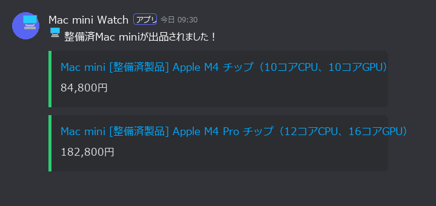

# mac-mini-refurb-watch

Apple公式の[整備済製品ページ](https://www.apple.com/jp/shop/refurbished/mac)を5分ごとにチェックして、以下が出品されたら**Discordに通知**します。

- **Mac mini**（全モデル）
- **MacBook Air（USキーボード搭載モデルのみ）**

GitHub Actionsで動くので、サーバー不要・完全無料です。


*（通知イメージ）*

## 仕組み

```
GitHub Actions (5分ごとのcron)
  └─ check.py
       ├─ Appleの整備済製品ページ（Mac mini / MacBook Air）を取得
       ├─ 埋め込みJSON (REFURB_GRID_BOOTSTRAP) から監視対象を抽出
       │    ├─ Mac mini：全モデル
       │    └─ MacBook Air：タイル情報または商品詳細ページでUSキーボードと判定したもの
       ├─ state.json（前回の出品リスト・キーボード判定キャッシュ）と比較
       ├─ 新着があれば Discord Webhook に通知
       └─ state.json を更新してリポジトリにコミット
```

依存ライブラリなし（Python標準ライブラリのみ）。

## セットアップ

### 1. Discord Webhookを作る

通知を受け取りたいDiscordチャンネルで：
**チャンネル設定（⚙️）→ 連携サービス → ウェブフック → 新しいウェブフック → URLをコピー**

### 2. GitHubリポジトリを作ってプッシュ

```sh
gh repo create mac-mini-refurb-watch --private --source . --push
```

### 3. Webhook URLをSecretに登録

```sh
gh secret set DISCORD_WEBHOOK_URL --body "https://discord.com/api/webhooks/..."
```

（またはリポジトリの Settings → Secrets and variables → Actions から `DISCORD_WEBHOOK_URL` を登録）

### 4. 動作確認

Actionsタブ → **Check refurbished Mac mini / MacBook Air (US)** → **Run workflow** で手動実行。
ログに `Mac mini: tiles: NNN, hit: N, new: N` のような行が監視対象ごとに出れば動いています。

## ローカルでの動作確認

```sh
python check.py                 # DISCORD_WEBHOOK_URL 未設定ならドライラン（通知内容をprintするだけ）
```

## 注意

- GitHub Actionsのcronは負荷状況で数分〜十数分遅れることがあります。
- **リポジトリに60日間コミットがないと、GitHubがスケジュール実行を自動停止します**（メールが来るのでActionsタブから再有効化すればOK）。在庫変動があるたびに `state.json` がコミットされるので、実際にはほぼ止まりません。
- 監視対象を増やしたい場合は `check.py` の `WATCHES` にエントリを追加してください（`url` とタイル判定関数のペア。モデル判別は `refurbClearModel`。例：`macstudio`, `macbookpro` など）。
- USキーボードのMacBook Airは、まず一覧タイル内の表記を確認し、判定できない場合だけ商品詳細ページを取得して判定します。結果はpartNumberごとに期限なしでキャッシュするため、同じ製品の詳細ページを繰り返し取得しません。詳細ページの取得に失敗した場合や「キーボード」の表記が見つからない場合は通知せず、キャッシュにも残さず次回に再試行します。
- 通知周期はGitHub Actionsのcron（`.github/workflows/check.yml`）で5分に設定しています。publicリポジトリなのでActionsは無料・無制限です（Privateに戻す場合は無料枠の都合で30分以上に戻すこと）。
