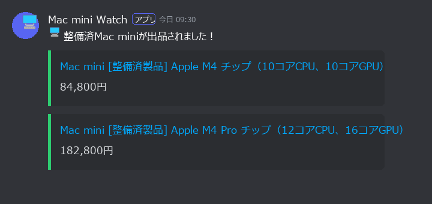

# mac-mini-refurb-watch

Apple公式の[整備済製品ページ](https://www.apple.com/jp/shop/refurbished/mac)を5分ごとにチェックして、以下が出品されたら**Discordに通知**します。

- **13インチMacBook Air・メモリ24GB以上（US・JISキーボード）**
- **13インチMacBook Pro・メモリ24GB以上（USキーボードのみ）**

※ リポジトリ名の由来であるMac mini監視は、M6搭載の新型発売に伴い2026-08-26に停止しました（復活させる場合はgit履歴参照）。

GitHub Actionsで動くので、サーバー不要・完全無料です。


*（通知イメージ）*

## 仕組み

```
GitHub Actions (5分ごとのcron)
  └─ check.py
       ├─ Appleの整備済製品ページ（MacBook Air / MacBook Pro）を取得
       ├─ 埋め込みJSON (REFURB_GRID_BOOTSTRAP) から監視対象を抽出
       │    └─ 機種・13インチ・メモリ24GB以上で絞り、タイル情報または商品詳細ページで配列を判定（Air: US/JIS、Pro: USのみ）
       ├─ state.json（前回の出品リスト・キーボード判定キャッシュ）と比較
       ├─ 新着があれば Discord Webhook に通知
       └─ state.json を更新してリポジトリにコミット
```

依存ライブラリなし（Python標準ライブラリのみ）。

## セットアップ

### 1. Discord Webhookを作る

通知を受け取りたいDiscordチャンネルで：
**チャンネル設定（⚙️）→ 連携サービス → ウェブフック → 新しいウェブフック → URLをコピー**

### 2. GitHubリポジトリを作ってプッシュ

```sh
gh repo create mac-mini-refurb-watch --private --source . --push
```

### 3. Webhook URLをSecretに登録

```sh
gh secret set DISCORD_WEBHOOK_URL --body "https://discord.com/api/webhooks/..."
```

（またはリポジトリの Settings → Secrets and variables → Actions から `DISCORD_WEBHOOK_URL` を登録）

### 4. 動作確認

Actionsタブ → **Check refurbished MacBook Air (US/JIS) / Pro (US)** → **Run workflow** で手動実行。
ログに `MacBook Air (USキーボード): tiles: NNN, hit: N, new: N` のような行が監視対象ごとに出れば動いています。

## ローカルでの動作確認

```sh
python check.py                 # DISCORD_WEBHOOK_URL 未設定ならドライラン（通知内容をprintするだけ）
```

## 注意

- GitHub Actionsのcronは負荷状況で数分〜十数分遅れることがあります。
- **リポジトリに60日間コミットがないと、GitHubがスケジュール実行を自動停止します**（メールが来るのでActionsタブから再有効化すればOK）。在庫変動があるたびに `state.json` がコミットされるので、実際にはほぼ止まりません。
- 監視対象を増やしたい場合は `check.py` の `WATCHES` に `model`・`url`・タイル判定関数を指定したエントリを追加してください。`model` はAppleの `refurbClearModel` に対応します。
- MacBook Air / Proは、まず一覧タイル内のUS/JIS表記を確認し、判定できない場合だけ商品詳細ページを取得します。AirはUS・JIS、ProはUSのみを通知し、通知の見出しに機種と配列を表示します。Air・Proとも13インチ（13.3/13.6インチを含む）・メモリ24GB以上が対象です。14/15/16インチやメモリ24GB未満、サイズ・メモリ不明の商品は通知しません。チップ・価格による制限はありません。
- キーボード配列はpartNumberごとに `us` / `jis` として保存します。不明・取得失敗・US/JIS両方の表記がある商品は通知せず、次回実行で再試行します。旧形式の `true` はUSとして引き継ぎ、`false`（非US）はJISと断定せず再判定します。
- JIS対応後の初回実行では、その時点で出品されている条件に合うJISのAirを新着として通知します。以後は追加・再入荷時に通知します。
- 通知周期はGitHub Actionsのcron（`.github/workflows/check.yml`）で5分に設定しています。publicリポジトリなのでActionsは無料・無制限です（Privateに戻す場合は無料枠の都合で30分以上に戻すこと）。
